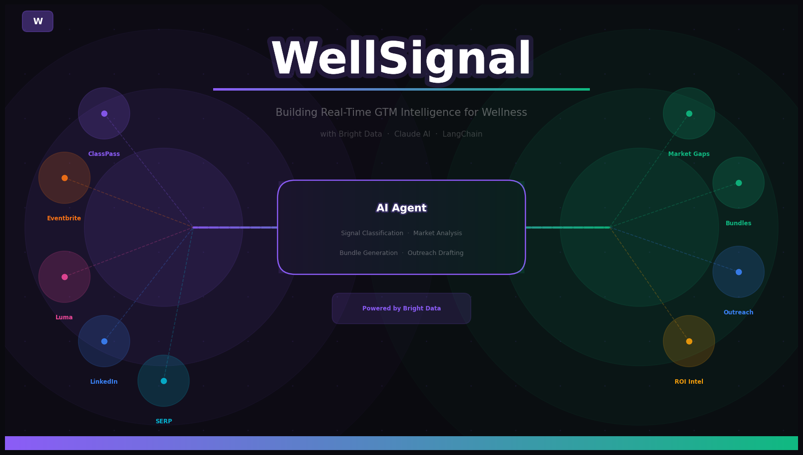

# WellSignal — GTM Intelligence Platform for Wellness



> Real-time market intelligence for wellness operators and corporate wellness teams, powered by **Bright Data** live web scraping and **Anthropic Claude AI**.

💻 **GitHub:** [github.com/abhijitbetigeri/WellSignal](https://github.com/abhijitbetigeri/WellSignal)

---

## What Is WellSignal?

WellSignal is a dual-sided GTM intelligence platform built for the wellness ecosystem. It continuously scrapes live web data — events, pricing, job postings, community signals — classifies them with Claude AI, and delivers actionable insights to two types of users:

| Mode | Who | What They Get |
|---|---|---|
| **Wellness Operator** | Studios, coaches, retreat centers, breathwork facilitators | Competitor pricing, demand signals, corporate buyer radar, bundle recommendations, B2B outreach drafts |
| **Corporate Wellness** | HR teams, people ops, employee experience leads | Curated vendor bundles, benchmarked pricing, ROI projections, outreach emails |

---

## Architecture

```
┌─────────────────────────────────────────────────────────────────────┐
│                        USER INTERFACE                               │
│                  Streamlit Dashboard / FastAPI                      │
│         Wellness Operator Mode  ◄──────►  Corporate HR Mode        │
└───────────────────────────┬─────────────────────────────────────────┘
                            │
                            ▼
┌─────────────────────────────────────────────────────────────────────┐
│                      SCRAPING LAYER                                 │
│               Bright Data Web Unlocker + SERP API                  │
│                                                                     │
│  ┌─────────────┐ ┌─────────────┐ ┌──────────┐ ┌────────────────┐  │
│  │  ClassPass  │ │ Eventbrite  │ │   Luma   │ │   Partiful     │  │
│  │  (pricing)  │ │  (events)   │ │ (events) │ │  (community)   │  │
│  └─────────────┘ └─────────────┘ └──────────┘ └────────────────┘  │
│  ┌─────────────┐ ┌─────────────┐ ┌──────────┐                     │
│  │   Reddit    │ │  LinkedIn   │ │   SERP   │                     │
│  │ (community) │ │ (corp buyer)│ │ (demand) │                     │
│  └─────────────┘ └─────────────┘ └──────────┘                     │
│                                                                     │
│              All responses cached locally (MD5 hash)               │
└───────────────────────────┬─────────────────────────────────────────┘
                            │  Raw Scraped Signals
                            ▼
┌─────────────────────────────────────────────────────────────────────┐
│                       AI PIPELINE                                   │
│                 LangChain + Anthropic Claude Haiku                  │
│                                                                     │
│  ┌──────────────────┐   ┌──────────────────┐   ┌───────────────┐  │
│  │ Signal Classifier│──►│Bundle Recommender│──►│Outreach       │  │
│  │                  │   │                  │   │Generator      │  │
│  │ • signal_type    │   │ • bundle_name    │   │               │  │
│  │ • urgency        │   │ • services       │   │ • subject     │  │
│  │ • geography      │   │ • price/employee │   │ • body        │  │
│  │ • wellness_cat   │   │ • projected_roi  │   │ • target_role │  │
│  │ • summary        │   │ • competitor_gap │   │ • signal_used │  │
│  └──────────────────┘   └──────────────────┘   └───────────────┘  │
│                                                                     │
│            Competitor Tracker (price/bundle delta detection)        │
└───────────────────────────┬─────────────────────────────────────────┘
                            │  Enriched Intelligence
                            ▼
┌─────────────────────────────────────────────────────────────────────┐
│                        OUTPUT LAYER                                 │
│                                                                     │
│  📊 Signal Cards     🎯 Market Gaps     📦 Bundle Plans            │
│  (65+ live signals)  (AI-detected gaps) (priced & scoped)          │
│                                                                     │
│  📧 Outreach Drafts  📈 ROI Projections  🏢 Competitor Intel       │
│  (personalized B2B)  (corporate mode)    (pricing deltas)          │
└─────────────────────────────────────────────────────────────────────┘
```

---

## Data Sources

| Source | What's Scraped | Method |
|---|---|---|
| **ClassPass** | Studio listings, class prices, ratings | Bright Data Web Unlocker |
| **Eventbrite** | Wellness events by city & category | Bright Data Web Unlocker |
| **Luma (lu.ma)** | Community events via Discover API | Direct JSON API |
| **Partiful** | Wellness community events by city | Bright Data Web Unlocker |
| **Reddit** | r/wellness, r/yoga community signals | Bright Data Web Unlocker |
| **LinkedIn** | Corporate wellness job postings | Bright Data Web Unlocker |
| **Google SERP** | Demand trends via search results | Bright Data SERP API |

---

## AI Agents

| Agent | Model | Role |
|---|---|---|
| **Signal Classifier** | Claude Haiku 4.5 | Tags each signal with type, urgency, geography, wellness category, and a one-line summary |
| **Bundle Recommender** | Claude Haiku 4.5 | Proposes 3 priced service bundles based on market gaps and competitor positioning |
| **Outreach Generator** | Claude Haiku 4.5 | Drafts personalized B2B emails using live signals as context |
| **Competitor Tracker** | Claude Haiku 4.5 | Detects pricing and bundle changes across scraped competitor data |

---

## Project Structure

```
wellsignal/
├── streamlit_app.py            # Streamlit demo dashboard
│
├── scrapers/                   # Bright Data scraping layer
│   ├── base_scraper.py         # Shared fetch logic + local caching
│   ├── classpass_scraper.py    # Competitor pricing & wellness studio listings
│   ├── eventbrite_scraper.py   # Event demand signals by category & location
│   ├── luma_scraper.py         # Luma Discover API — wellness community events
│   ├── partiful_scraper.py     # Partiful explore pages — wellness events
│   ├── reddit_scraper.py       # Community interest signals
│   ├── linkedin_scraper.py     # Corporate buyer radar (job postings)
│   └── serp_scraper.py         # Google demand trends via SERP API
│
├── agents/                     # AI intelligence layer
│   ├── signal_classifier.py    # Scores & classifies raw signals
│   ├── competitor_tracker.py   # Detects price/bundle changes over time
│   ├── bundle_recommender.py   # Recommends services + pricing
│   └── outreach_generator.py   # Drafts personalized B2B outreach emails
│
├── api/                        # FastAPI backend
│   └── main.py                 # /operator/analyze, /corporate/recommend
│
├── cache/                      # Local JSON cache (MD5-hashed URLs)
├── requirements.txt
└── .env.example                # Environment variable template
```

---

## Quick Start

### 1. Clone & install

```bash
git clone https://github.com/abhijitbetigeri/WellSignal.git
cd WellSignal
python -m venv venv && source venv/bin/activate
pip install -r requirements.txt
```

### 2. Set environment variables

```bash
cp .env.example .env
# Edit .env and fill in your keys:
# BRIGHTDATA_API_TOKEN=...
# BRIGHTDATA_ZONE=web_unlocker1
# ANTHROPIC_API_KEY=...
```

### 3. Run the Streamlit dashboard

```bash
streamlit run streamlit_app.py
```

### 4. (Optional) Run the FastAPI backend

```bash
uvicorn api.main:app --reload
# POST /operator/analyze
# POST /corporate/recommend
```

---

## API Endpoints

### `POST /operator/analyze`
Runs the full operator intelligence pipeline for a location and wellness category.

```json
{
  "location": "san-francisco",
  "category": "yoga"
}
```

Returns: classified signals, market gaps, bundle recommendations, outreach drafts.

### `POST /corporate/recommend`
Generates corporate wellness bundle recommendations for an HR team.

```json
{
  "company": "Stripe",
  "industry": "tech",
  "employee_count": 500,
  "location": "san-francisco",
  "budget_per_employee": 150
}
```

Returns: vendor bundles, ROI projections, outreach emails.

---

## Environment Variables

| Variable | Description |
|---|---|
| `BRIGHTDATA_API_TOKEN` | Bright Data API token (from dashboard) |
| `BRIGHTDATA_ZONE` | Web Unlocker zone name (default: `web_unlocker1`) |
| `ANTHROPIC_API_KEY` | Anthropic API key for Claude |

---

## Tech Stack

| Layer | Technology |
|---|---|
| Web scraping | Bright Data Web Unlocker, SERP API |
| HTML parsing | BeautifulSoup4 + lxml |
| AI agents | LangChain + Anthropic Claude Haiku 4.5 |
| Backend API | FastAPI + Uvicorn |
| Dashboard | Streamlit |
| Caching | Local JSON (MD5-hashed filenames) |

---

## Blog

Full technical deep-dive: [BLOG.md](BLOG.md)

---

## License

MIT
